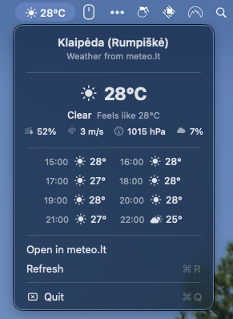

# MeteoBaras

A macOS menu bar weather app that displays the current temperature in Celsius using data from [meteo.lt](https://api.meteo.lt/).



## Features

- **Menu bar display** - Shows current temperature (°C) with a weather icon in the macOS status bar
- **Detailed weather menu** - Click the icon to see:
  - Current temperature and "feels like" temperature
  - Weather condition with icon
  - Latest station observations (humidity, wind, pressure, cloud cover)
  - 8-hour forecast grid with temperatures and conditions
  - A link to open the full forecast on meteo.lt
- **Auto location** - Automatically detects your location and finds the nearest weather place
- **Auto refresh** - Weather data refreshes automatically every 15 minutes, or on demand via the Refresh item

## Download

Grab the latest build from the [Releases page](https://github.com/fosron/MeteoBaras/releases) — download the `.zip`, unzip it, and move `MeteoBaras.app` to your Applications folder.

This build is signed with an ad-hoc (self) signature rather than a paid Apple Developer ID, so macOS Gatekeeper will flag it as being from an "unidentified developer." To run it:

1. Right-click (or Control-click) `MeteoBaras.app` and choose **Open**
2. Click **Open** again in the dialog that appears

You only need to do this once — after that it launches normally like any other app.

## Requirements

- macOS 13.0 (Ventura) or later
- Swift 6.0+
- Location access (requested on first launch)

## Building & Running from Source

```bash
swift build
swift run MeteoBaras
```

## Data Source

Weather data is provided by the [Lithuanian Hydrometeorological Service](https://meteo.lt/) (LHMT) through their public API at [api.meteo.lt](https://api.meteo.lt/).

## License

MIT
